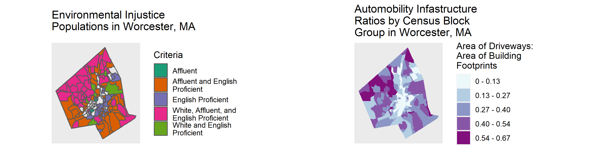

```{r setup, include=FALSE}
knitr::opts_chunk$set(echo = TRUE)
library(dplyr)
library(sf)
library(tidyverse)
library(tidycensus)
library(tigris)
```

## Objective

In food desert mapping, theoretically if communities are not proximate to supermarkets, then cars (or public transportation) can enable food access. To consider the systemic roots of spatial food accessibility however requires urban histories of racist zoning policies and suburban resettlement patterns to have a role in the story as well. The map produced below will examine the scale of parking infastructure in different neighborhoods of the city to understand how automobility enables white flight and food access for certain residents. 

To do this, the ratio of parking infastructure area, represented by driveway parcels, to building footprint area will be calculated by census block group and will be mapped alongside the Environmental Injustice Populations identified in the first mapping exercise.


## Mapping Process

### Data Preperation

#### Read in files

Read in and recreate Environmental Injustice Population data
```{r, warning = FALSE, message = FALSE, error = TRUE, eval=FALSE}
# data source: see eijpop vignette

# read in ej pop data
maejpop <- read_sf("C:/Users/Brenna Robeson/OneDrive/Masters_Research_Project/Empirics/GIS_Analysis/extdata/EJ_POLY.shp")

# project maejpop to EPSG:32618, WSG84 UTM Zone 18N
maejpop <- st_transform(x = maejpop, crs = st_crs("+proj=utm +zone=18 +ellps=WGS84 +datum=WGS84 +units=m +no_defs"))

# filter out Worcester-only data and view first few rows
ejpop <- maejpop %>% st_as_sf() %>% filter(TOWN == "WORCESTER")
head(ejpop)

# read in MA census block groups
macbg <- read_sf("C:/Users/Brenna Robeson/OneDrive/Masters_Research_Project/Empirics/GIS_Analysis/extdata/CENSUS2010BLOCKGROUPS_POLY.shp") 

# project maejpop to EPSG:32618, WSG84 UTM Zone 18N
macbg <- st_transform(x = macbg, crs = st_crs("+proj=utm +zone=18 +ellps=WGS84 +datum=WGS84 +units=m +no_defs"))

# filter out only Worcester block groups
cbg <- macbg %>% st_as_sf() %>% filter(GEOID10 %in% 250277301001:250277331022)
head(cbg)

# join ejpop data to cbg data
ejjoincol <- ejpop %>% select(LOGSF1, MINORITY, INCOME, ENGLISH, EJ_CRITERI) 
cbg_ejpop <- left_join(cbg %>% select(GEOID10, LOGSF1) %>% as_tibble, 
                       ejjoincol %>% as.data.frame() %>% select(-geometry), 
                       by = "LOGSF1") %>% st_as_sf()

# # test results of join
# ejjoincol %>% filter(LOGSF1 == 171758)
# cbg %>% filter(LOGSF1 == 171758)
# cbg_ejpop %>% filter(LOGSF1 == 171758)
# 
# cbg_ejpop %>% st_as_sf() %>% select(MINORITY) %>% plot()
# cbg_ejpop %>% filter(!is.na(MINORITY))

# create new columns WHITE, AFFLUENT, ENGLISHPROF, EIJ_CRITERI in cbg_ejpop
cbg_ejpop <- cbg_ejpop %>% 
  mutate(WHITE = ifelse(is.na(MINORITY), "W", NA)) %>% 
  mutate(AFFLUENT = ifelse(is.na(INCOME), "A", NA)) %>% 
  mutate(ENGLISHPROF = ifelse(is.na(ENGLISH), "P", NA)) %>% 
  unite(EIJ_GRP, WHITE, AFFLUENT, ENGLISHPROF, sep = "", remove = FALSE) %>% 
  mutate(EIJ_GRP = gsub("NA", "", EIJ_GRP)) 

# create eij pop which includes only eij populations
eijpop <- cbg_ejpop %>% filter(EIJ_GRP != "")
```

Read in Driveways, Buildings, and Roads shapefile data
```{r, warning = FALSE, message = FALSE, error = TRUE, eval=FALSE}
# read in driveways data, project to EPSG:32618, WSG84 UTM Zone 18N, and vaildate geometries
# data source: City of Worcester
drive <- read_sf("C:/Users/Brenna Robeson/OneDrive/Masters_Research_Project/Empirics/GIS_Analysis/extdata/Basemap_Driveways.shp") %>% 
  st_transform(x = ., crs = st_crs("+proj=utm +zone=18 +ellps=WGS84 +datum=WGS84 +units=m +no_defs")) %>% 
  st_as_sf() %>% lwgeom::st_make_valid()
head(drive)

# read in buildings data, project to EPSG:32618, WSG84 UTM Zone 18N, and vaildate geometries
# data source: City of Worcester
build <- read_sf("C:/Users/Brenna Robeson/OneDrive/Masters_Research_Project/Empirics/GIS_Analysis/extdata/Basemap_Buildings.shp") %>% 
  st_transform(x = ., crs = st_crs("+proj=utm +zone=18 +ellps=WGS84 +datum=WGS84 +units=m +no_defs")) %>% 
  st_as_sf() %>% lwgeom::st_make_valid()
head(build)

# data exploration - overall driveway to building area ratio in Worcester
overratio <- sum(drive$SHAPE_Area) / sum(build$Shape_Area)
overratio

# read in roads data, project to EPSG:32618, WSG84 UTM Zone 18N 
roads <- st_read(dsn = "C:/Users/Brenna Robeson/OneDrive/Masters_Research_Project/Empirics/GIS_Analysis/extdata/Worcester2019.gdb", layer = "Basemap_Street_Centerlines", as_tibble = TRUE) %>% 
  st_transform(x = ., crs = st_crs("+proj=utm +zone=18 +ellps=WGS84 +datum=WGS84 +units=m +no_defs")) 

# create selection of highways to be displayed over auto ratio
highways <- roads %>% filter(ROADCLASS == "Highway")
```


### Create Automobility Ratio
```{r, warning = FALSE, message = FALSE, error = TRUE, eval=FALSE}
# SPLIT 
### DRIVEWAYS ##################################
# convert driveway polygons to centroids with one variable - `SHAPE_Area`
drivecent <- drive[7] %>% st_centroid()

# spatial join of driveway centroids to block groups from cbg_ejpop then take sum by block group
geopv <- cbg_ejpop %>% filter(GEOID10 == 250277318003) %>% select(geometry) # to account for a block group without any driveway geometries which would otherwise be lost in the spatial join

drivecbg <- cbg_ejpop %>% 
  select(GEOID10) %>% 
  st_join(drivecent, ., left = TRUE) %>% 
  group_by(GEOID10) %>% 
  summarize(BG_DSUM = sum(SHAPE_Area)) %>% 
  as.data.frame %>% 
  add_row(., GEOID10 = "250277318003", BG_DSUM = 0, geometry = st_geometry(geopv)) %>% 
  as_tibble %>% st_as_sf()

### BUILDINGS ##################################
# convert building polygons to centroids
buildcent <- build[15] %>% st_centroid()

# spatial join of building centroids (with area variable) to block groups from cbg_ejpop then take sum by block group
buildcbg <- cbg_ejpop %>% 
  select(GEOID10) %>% 
  st_join(buildcent, ., left = TRUE) %>% 
  group_by(GEOID10) %>%
  summarize(BG_BSUM = sum(Shape_Area)) 
  
# APPLY and COMBINE
# for each block group in cbg_ejpop, divide `BG_DSUM` by `BG_BSUM` into new field `AUTORATIO`
cbg_ejpop_d <- left_join(cbg_ejpop %>% 
                             as.data.frame, drivecbg %>% 
              as.data.frame() %>% select(-geometry), 
                       by = "GEOID10") %>% 
  as_tibble %>% st_as_sf()
automob <- left_join(cbg_ejpop_d %>% 
              as.data.frame, buildcbg %>% 
              as.data.frame() %>% select(-geometry), 
                       by = "GEOID10") %>%
  as_tibble %>% st_as_sf() %>% 
  mutate(AUTORATIO = BG_DSUM / BG_BSUM)
  

# # test that values are consistient between drivecbg and joined table
# drivecbg %>% filter(GEOID10 == 250277304011)
# autoratiotest %>% filter(GEOID10 == 250277304011) %>% select(BG_DSUM)
# 
# # test that values consistient between buildcbg and joined output
# buildcbg %>% filter(GEOID10 == 250277304011)
# autoratiotest %>% filter(GEOID10 == 250277304011) %>% select(BG_BSUM)
```


### Visualization

Visualization 1: EIJ Population to Raito Comparison
```{r, warning = FALSE, message = FALSE, error = TRUE, fig.width=7, fig.height=5, fig.align='center', eval=FALSE}
# map Enviro Injustice Popuations for reference
cbg_plot <- cbg %>% st_geometry()
eijpopplot <- ggplot() +
  geom_sf(data = cbg_plot) +
  geom_sf(data = eijpop, aes(fill = EIJ_GRP), legend = polygon) +
  scale_fill_brewer(palette = "Dark2", name = "Criteria", labels = c("Affluent", "Affluent and English \nProficient", "English Proficient", "White, Affluent, and \nEnglish Proficient", "White and English \nProficient")) + 
  ggtitle("Environmental Injustice \nPopulations in Worcester, MA") +
  coord_sf(datum = NA)
eijpopplot

# map automobility ratios as choropleth 
automobplot <- automob %>% 
  mutate(rat_cut = cut_interval(AUTORATIO, 5)) %>% 
ggplot() +
  geom_sf(aes(fill = rat_cut), color = NA) +
  scale_fill_brewer(palette = "BuPu", name = "Area of Driveways:\nArea of Building \nFootprints", labels = c("0 - 0.13", "0.13 - 0.27", "0.27 - 0.40", "0.40 - 0.54", "0.54 - 0.67")) +
  ggtitle("Automobility Infastructure \nRatios by Census Block \nGroup in Worcester, MA") +
  coord_sf(datum = NA)
automobplot

```

```{r, warning = FALSE, message = FALSE, error = TRUE, fig.width=10, fig.height=4, fig.align='center', eval=FALSE}

# map two side-by-side with cowplot
gp <- cowplot::plot_grid(eijpopplot, automobplot, ncol = 2, align = "h", label_size = 10)
gp

# make a png so knit is not dependent on cowplot
ggplot2::ggsave(gp, filename = "C:/Users/Brenna Robeson/OneDrive/GEOG346/worcfoodaccess/figures/automob_plot.png", 
       width = 10, height = 2.5, units = "in", dpi = 300)
```


```{r, echo = FALSE, out.width="100%"}

```

Visualiation 2: Automobility Ratios with Highways Overlayed
```{r, warning = FALSE, message = FALSE, error = TRUE, fig.width=7, fig.height=5, fig.align='center', eval=FALSE}
# map automobility ratios as choropleth and add highways
automobhighplot <- automob %>% 
  mutate(rat_cut = cut_interval(AUTORATIO, 5)) %>% 
ggplot() +
  geom_sf(aes(fill = rat_cut), color = NA) + 
  scale_fill_brewer(palette = "BuPu", name = "Driveway-to-Building \nArea Ratio by \nCensus Block Group", #"Area of Driveways:\nArea of Building \nFootprints",
                    labels = c("0 - 0.13", "0.13 - 0.27", "0.27 - 0.40", "0.40 - 0.54", "0.54 - 0.67"),  guide = guide_legend(override.aes = list(linetype = "blank", shape = NA))) +
  geom_sf(data = highways, aes(color = "Highway"), show.legend = "line") +
  scale_colour_manual(name = NULL, values = ("Highway" = "orangered2")) + 
  theme(legend.key = element_rect(fill = "white")) +
  ggtitle("Automobility Infastructure \nin Worcester, MA") + # fix title
  theme_void() + # Empty theme without axis lines and texts
  theme(
    panel.background = element_rect(fill = "transparent", colour = NA),
    plot.background = element_rect(fill = "transparent", colour = NA),
    legend.background = element_rect(fill = "transparent", colour = NA),
    legend.box.background = element_rect(fill = "transparent", colour = NA)
  ) +
  coord_sf(datum = NA)
automobhighplot
```

```{r, warning = FALSE, message = FALSE, error = TRUE, fig.width=10, fig.height=4, fig.align='center', eval=FALSE}
# make a png so knit is not dependent on cowplot
ggplot2::ggsave(automobhighplot, filename = "C:/Users/Brenna Robeson/OneDrive/GEOG346/worcfoodaccess/figures/automobhigh_plot.png", 
       width = 6, height = 5, units = "in", dpi = 300)
```


## Limitations

Future versions of this map can incorporate for context and comparison the USDA's Food Desert Atlas food desert layers that show food access as they calculate it by vechile availability.


