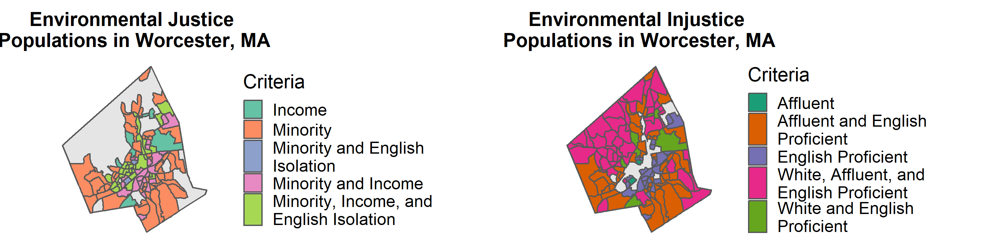

```{r setup, include=FALSE}
knitr::opts_chunk$set(echo = TRUE)
library(dplyr)
library(sf)
library(tidyverse)
library(tidyr)
library(ggplot2)
library(cowplot)
```

## Objective

This mapping exercise shifts the focus from the end result of environmental (and along similar lines, food) injustice to those who help perpetuate it through residential segregation and intentional settlement patterns in the urban design of cities. MassGIS's Environmental Justice Populations data is used as an example to bring this alternative perspective to life. 

## Mapping Process

### Data Preperation
Read in Environmental Justice (EJ) Population and Census Block Group data for Worcester

```{r, warning = FALSE, message = FALSE, error = TRUE, eval = FALSE}
# read in MA Town Boundaries data
# data source: https://docs.digital.mass.gov/dataset/massgis-data-community-boundaries-towns-survey-points
matowns <- read_sf("C:/Users/Brenna Robeson/OneDrive/Masters_Research_Project/Empirics/GIS_Analysis/extdata/TOWNS_POLY.shp") 

# project matowns to EPSG:32618, WSG84 UTM Zone 18N
matowns <- st_transform(x = matowns, crs = st_crs("+proj=utm +zone=18 +ellps=WGS84 +datum=WGS84 +units=m +no_defs"))

# filter out Worcester boundary
worc <- matowns %>% st_as_sf() %>% filter(TOWN == "WORCESTER")

# read in ej pop data
# data source: https://docs.digital.mass.gov/dataset/massgis-data-2010-us-census-environmental-justice-populations
maejpop <- read_sf("C:/Users/Brenna Robeson/OneDrive/Masters_Research_Project/Empirics/GIS_Analysis/extdata/EJ_POLY.shp")

# project maejpop to EPSG:32618, WSG84 UTM Zone 18N
maejpop <- st_transform(x = maejpop, crs = st_crs("+proj=utm +zone=18 +ellps=WGS84 +datum=WGS84 +units=m +no_defs"))

# filter out Worcester-only data and view first few rows
ejpop <- maejpop %>% st_as_sf() %>% filter(TOWN == "WORCESTER")
head(ejpop)

# read in MA census block groups
# data source: https://docs.digital.mass.gov/dataset/massgis-data-datalayers-2010-us-census?_ga=2.217715734.1671376923.1557296954-1576956268.1544722457
macbg <- read_sf("C:/Users/Brenna Robeson/OneDrive/Masters_Research_Project/Empirics/GIS_Analysis/extdata/CENSUS2010BLOCKGROUPS_POLY.shp") 

# project maejpop to EPSG:32618, WSG84 UTM Zone 18N
macbg <- st_transform(x = macbg, crs = st_crs("+proj=utm +zone=18 +ellps=WGS84 +datum=WGS84 +units=m +no_defs"))

# filter out only Worcester block groups
cbg <- macbg %>% st_as_sf() %>% filter(GEOID10 %in% 250277301001:250277331022)
head(cbg)
```

### Create Environmental Injustice (EIJ) data
```{r, warning = FALSE, message = FALSE, error = TRUE, eval = FALSE}
# join ejpop's MINORITY, INCOME, ENGLISH, EJ_CRITERI columns to cbg with LOGSF1
ejjoincol <- ejpop %>% select(LOGSF1, MINORITY, INCOME, ENGLISH, EJ_CRITERI) 

cbg_ejpop <- left_join(cbg %>% select(GEOID10, AREA_SQFT, POP100_RE, LOGSF1) %>% as_tibble, 
                       ejjoincol %>% as.data.frame() %>% select(-geometry), 
                       by = "LOGSF1") %>% st_as_sf()

# # test results of join
# ejjoincol %>% filter(LOGSF1 == 171758)
# cbg %>% filter(LOGSF1 == 171758)
# cbg_ejpop %>% filter(LOGSF1 == 171758)
# 
# cbg_ejpop %>% st_as_sf() %>% select(MINORITY) %>% plot()
# cbg_ejpop %>% filter(!is.na(MINORITY))

# create new columns WHITE, AFFLUENT, ENGLISHPROF, EIJ_CRITERI in cbg
cbg_ejpop <- cbg_ejpop %>% 
  mutate(WHITE = ifelse(is.na(MINORITY), "W", NA)) %>% 
  mutate(AFFLUENT = ifelse(is.na(INCOME), "A", NA)) %>% 
  mutate(ENGLISHPROF = ifelse(is.na(ENGLISH), "P", NA)) %>% 
  unite(EIJ_GRP, WHITE, AFFLUENT, ENGLISHPROF, sep = "", remove = FALSE) %>% 
  mutate(EIJ_GRP = gsub("NA", "", EIJ_GRP)) 

# create eij pop which includes only eij populations
eijpop <- cbg_ejpop %>% filter(EIJ_GRP != "")

# export eij pop layer for future use 
# st_write(eijpop, "C:/Users/Brenna Robeson/OneDrive/Masters_Research_Project/Empirics/GIS_Analysis/extdata/eijpop.shp")
```

### Create visualizations

#### Map EJ Populations
```{r, warning = FALSE, message = FALSE, error = TRUE, eval = FALSE}
ejpopplot <- ggplot() +
  geom_sf(data = worc, fill = "gray80", color = "gray80") +
  geom_sf(data = ejpop, aes(fill = EJ_CRITERI), legend = polygon) +
  scale_fill_brewer(palette = "Set2", name = "Criteria", labels = c("Income", "Minority", "Minority and English \nIsolation", "Minority and Income", "Minority, Income, and \nEnglish Isolation")) + 
  coord_sf(datum = NA) +
  ggtitle("Environmental Justice \nPopulations in Worcester, MA")
ejpopplot
```

#### Map EIJ Populations
```{r, warning = FALSE, message = FALSE, error = TRUE, eval = FALSE}
eijpopplot <- ggplot() +
  geom_sf(data = worc) +
  geom_sf(data = eijpop, aes(fill = EIJ_GRP), legend = polygon) +
  scale_fill_brewer(palette = "Dark2", name = "Criteria", labels = c("Affluent", "Affluent and English \nProficient", "English Proficient", "White, Affluent, and \nEnglish Proficient", "White and English \nProficient")) + 
  coord_sf(datum = NA) +
  ggtitle("Environmental Injustice \nPopulations in Worcester, MA") 
eijpopplot
```

#### Create side-by-side plot
```{r, warning = FALSE, message = FALSE, error = TRUE, fig.width=10, fig.height=5, fig.align='center', eval=FALSE}
# map two side-by-side with cowplot
gp <- cowplot::plot_grid(ejpopplot, eijpopplot, ncol = 2, align = "h")
gp

# make a png so knit is not dependent on cowplot
ggplot2::ggsave(gp, filename = "C:/Users/Brenna Robeson/OneDrive/GEOG346/worcfoodaccess/figures/eijpop_plot.png", 
       width = 10, height = 5, units = "in", dpi = 300)
```

#### Create stacked plot
```{r, warning = FALSE, message = FALSE, error = TRUE, fig.width=6, fig.height=9, fig.align='center', eval=FALSE}

# map two side-by-side with cowplot
gp <- cowplot::plot_grid(ejpopplot, eijpopplot, nrow = 2, align = "h")
gp

# make a png so knit is not dependent on cowplot
ggplot2::ggsave(gp, filename = "C:/Users/Brenna Robeson/OneDrive/GEOG346/worcfoodaccess/figures/eijpopstacked_plot.png", 
       width = 6, height = 9, units = "in", dpi = 300)
```

```{r, echo = FALSE, out.width="100%"}
# display plot in markdown file

```

## Limitations

A limitation of this visualization that should be noted relates to the process used by MassGIS analysts for selecting "enviornmental justice population" census block groups. Block groups that might have otherwise been included were not if: 

* 65% or or more the total adult population of the block group lives in university housing and/or correctional facilities
* land use or function is not relevant to environmental justice concerns, such as parks, industrial areas, or block groups with no daytime population

Future versions of this excercise should seek to explore the demographic statistics of Environmental Injustice Populations more deeply so they are not simply inverses of MassGIS's categories, but in fact reflect statistically signifigant concentrations of individuals associated with the featured categories.


