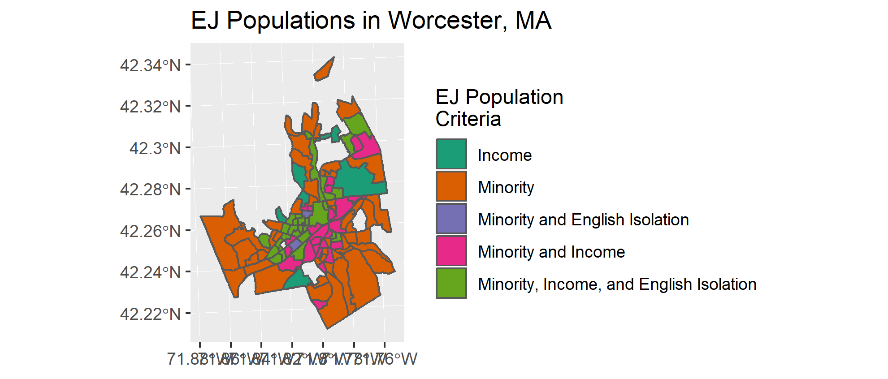
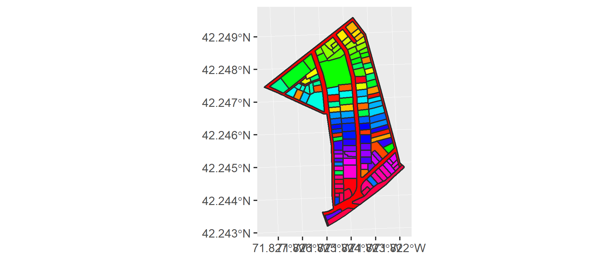
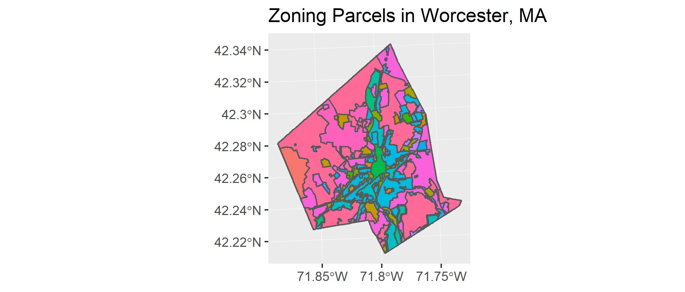

```{r setup, include=FALSE}
knitr::opts_chunk$set(echo = TRUE)
library(kableExtra)
library(readr)
library(dplyr)
library(ggplot2)
library(sf)
library(knitr)
```

## Summary

My final project will contribute to my master's paper work on critically evaluating food access policies and efforts in Worcester to provide alternative maps which reflect principles of food justice. After a process of interviewing different key stakeholders around the city, I will make food access-related maps grounded in the reflections, needs, and shortcomings of feedback I collected. Along with stakeholder input, my analysis will look beyond the typically-relied upon actors and factors of food access maps, particularly those displayed by food desert maps. Instead, informed by thinking from Critical GIS, the outputs and perspectives I offer will seek to illuminate the often invisibilized actors and processes in urban landscapes which create areas where food accessibility is a concern. 

To mobilize these ideas, I will employ data on census-determined demographics and on Worcester’s built environment to explore how place-based food injustice is produced using R’s geospatial capabilities. Therefore, my objectives include:

* Develop alternative ways of depicting what drives food inaccess in urban contexts 
* Explore the specific role of land use, control, and ownership as a basis for these alternative viewpoints
* Use R-based spatial analysis to communicate my findings

Specifically, I hope that my data and analysis can lead me to develop three main outputs:

1.  Map of Worcester’s Environmental Injustice Populations, based on MassGIS’s Environmental Justice Populations (https://docs.digital.mass.gov/dataset/massgis-data-2010-us-census-environmental-justice-populations?_ga=2.99772631.856141472.1548130339-583552954.1544722457)
2.  Analysis of the spatial dissonance between properties and their owners and rentership versus ownership patterns in “food deserts” (based on method developed by Shelton (2018))
3.  Exploration of automobility in urban landscapes and if and how white and affluent populations insulate themselves using parking infrastructure and auto-friendly residential zoning


## Approach and Method

### Data

The data I will use for my analysis will supply mainly information about demographic patterns throughout the city by census tract and block group, specifications about land ownership and classifications, and features of the built environment. 


#### Key Datasets and Visualizations

##### USDA Food Deserts

Source: USDA

Year: 2015

Data Format: Table

Represents commonly-depended upon by public health policy makers' measure of food access in city. Census tracts are selected based on two criteria: (1) median income lower than 80% of the state median income and (2) lack of a nearby grocery store

Key variables to be used are LILATracts_1And10, LILATracts_halfAnd10, and CensusTract for joining with spatial data. 

```{r, warning = FALSE, message = FALSE, error = TRUE, eval=FALSE}
# read in food desert .csv
worcfd <- read_csv("C:/Users/Brenna Robeson/OneDrive/Masters_Research_Project/Empirics/GIS_Analysis/extdata/DesAtlas_2015_WorcSel.csv")

# filter out Worcester-relevant data
worcfd <- worcfd %>% filter(CensusTract %in% 25027727100:25027761300)

# view first few rows of data
head(worcfd)
```


##### MA Environmental Justice Populations 

Source: MassGIS

Year: 2010

Data Format: Shapefile

Extracting Worcester block groups.
This file, created by MassGIS, identifies Census block groups which are vulnerable to environmental injustices as defined by three criteria. These include 

* 25% or more of the population being classified as a “minority” (Minority)
* a median household income at or lower than 65% of the MA state median (Income)
* A 25% or lower prevalence of adult English speakers in households (English Isolation)

Of these factors, multiple or all can be found to occur in one block group. 

Key variables to be used are EJ_CRITERI, ENGLISH, MINORITY, and INCOME. 

```{r, warning = FALSE, message = FALSE, fig.width=6, fig.height=4, fig.align='center', eval=FALSE}
# read in ej pop data
maejpop <- read_sf("C:/Users/Brenna Robeson/OneDrive/Masters_Research_Project/Empirics/GIS_Analysis/extdata/EJ_POLY.shp")

# project maejpop to EPSG:32618, WSG84 UTM Zone 18N
maejpop <- st_transform(x = maejpop, crs = st_crs("+proj=utm +zone=18 +ellps=WGS84 +datum=WGS84 +units=m +no_defs"))

# filter out Worcester-only data and view first few rows
ejpop <- maejpop %>% st_as_sf() %>% filter(TOWN == "WORCESTER")
head(ejpop)
```

```{r, warning = FALSE, message = FALSE, fig.width=6, fig.height=4, fig.align='center', results = "hide", eval=FALSE}
# plot ejpop with EJ_CRITERI
ejpopplot <- ggplot(ejpop) +
  geom_sf(aes(fill = EJ_CRITERI), legend = polygon) +
  scale_fill_brewer(palette = "Dark2") + 
  ggtitle("EJ Populations in Worcester, MA") +
  scale_fill_manual(values = c("#1B9E77", "#D95F02", "#7570B3", "#E7298A", "#66A61E"), labels = c("Income", "Minority", "Minority and English Isolation", "Minority and Income", "Minority, Income, and English Isolation"), name = "EJ Population\nCriteria")
ejpopplot

# save output to a .png
ggsave("C:/Users/Brenna Robeson/OneDrive/GEOG346/worcfoodaccess/figures/a6_ejpop.png", plot = ejpopplot, #device = NULL, path = "C:/Users/Brenna Robeson/OneDrive/IDCE30109/emilee_boscrime/a6_ejpop.png",
  scale = 1, limitsize = TRUE)
```
```{r, out.width = "80%", echo=FALSE, fig.align='center'}

```

##### Worcester Property Parcels

Source: City of Worcester

Year: 2019

Data Format: Shapefile

This file will be used to understand land ownership. The property owner’s mailing address fields will be of interest based on if it is the same as the actual parcel and will eventually be geocoded. 

Key variable to be used is `map_par_id` which will be used to join spatial data to the variable `gis_mbl` in the parcel database which contains more comprehensive information about the owner and value of each property. 

```{r, warning = FALSE, message = FALSE, fig.width=6, fig.height=4, fig.align='center', eval=FALSE}
# read in parcel shape file
parcels <- read_sf("C:/Users/Brenna Robeson/OneDrive/Masters_Research_Project/Empirics/GIS_Analysis/extdata/Basemap_Parcels_Polygons.shp")
head(parcels)

# project parcels to EPSG:32618, WSG84 UTM Zone 18N
parcels <- st_transform(x = parcels, crs = st_crs("+proj=utm +zone=18 +ellps=WGS84 +datum=WGS84 +units=m +no_defs")) %>% st_as_sf()
```
```{r, warning = FALSE, message = FALSE, fig.width=6, fig.height=4, fig.align='center', results = "hide", eval=FALSE}
# intersect parcel data wtih object from ejpop census block group to show subset of parcel data
testarea <- ejpop %>% slice(1) %>% st_as_sf
# par(mar = rep(0, 4))
# plot(st_geometry(parcels), col = "grey")
# plot(st_geometry(testarea), col = "purple", add = TRUE)
parcels_testarea <- st_intersection(x = testarea, y = parcels) %>% 
  st_geometry() 
par(mar = rep(0, 4))
#plot(st_geometry(parcels), col = "grey")
parcels_subset <- ggplot(data = parcels_testarea) +
  geom_sf(aes(fill = MAP_PAR_ID), fill = rainbow(n = nrow(parcels_testarea %>% as_tibble)), col = "gray17")
parcels_subset

# save output to a .png
ggsave("C:/Users/Brenna Robeson/OneDrive/GEOG346/worcfoodaccess/figures/a6_parcels_subset.png", plot = parcels_subset, scale = 1, limitsize = TRUE)
```

```{r, out.width = "80%", echo=FALSE, fig.align='center'}

```


##### Worcester Zoning

Source: City of Worcester

Year: 2019

Data Format: Shapefile

Areas zoned for residential use will be filtered and used in analysis.

```{r, warning = FALSE, message = FALSE, fig.width=6, fig.height=4, fig.align='center', eval=FALSE}
# read in zoning shape file
zoning <- read_sf("C:/Users/Brenna Robeson/OneDrive/Masters_Research_Project/Empirics/GIS_Analysis/extdata/Basemap_Zoning.shp")
head(zoning)

# project zoning to EPSG:32618, WSG84 UTM Zone 18N
zoning <- st_transform(x = zoning, crs = st_crs("+proj=utm +zone=18 +ellps=WGS84 +datum=WGS84 +units=m +no_defs")) %>% st_as_sf()

# colourCount <- length(unique(zoning$NAME))
# getPalette <- colorRampPalette(brewer.pal((n = length(colourCount)), "Set1"))
#  
# ggplot(mtcars) + 
#   geom_histogram(aes(factor(hp)), fill=getPalette(colourCount)) + 
#   theme(legend.position="right")
```
```{r, warning = FALSE, message = FALSE, fig.width=6, fig.height=4, fig.align='center', results = "hide", eval=FALSE}
# plot zoning by NAME
zoningplot <- ggplot(zoning) +
  geom_sf(aes(fill = NAME), legend = polygon) +
  ggtitle("Zoning Parcels in Worcester, MA") +
  theme(legend.position='none')
zoningplot

# save output to a .png
ggsave("C:/Users/Brenna Robeson/OneDrive/GEOG346/worcfoodaccess/figures/a6_zoning.png", plot = zoningplot, #device = NULL, path = "C:/Users/Brenna Robeson/OneDrive/IDCE30109/emilee_boscrime/a6_ejpop.png",
  scale = 1, limitsize = TRUE)
```

```{r, out.width = "80%", echo=FALSE, fig.align='center'}

```


#### Other Data Used and Sources

```{r, warning = FALSE, message = FALSE, error = TRUE, echo = FALSE}
nm <- c("Worcester City Boundary", "Census Tracts for Worcester, MA", "Census Block Groups for Worcester, MA",  "Worcester Property Parcel Ownership Database", "Worcester Parking Surfaces", "Worcester Driveway Surfaces"
)
sr <- c("MassGIS", "MassGIS", "MassGIS", "City of Worcester", "City of Worcester", "City of Worcester")
yr <- c("2014", "2010", "2010", "2019", "2019", "2019")
dft <- c("Shapefile", "Shapefile", "Shapefile", "Geodatabase Table", "Shapefile", "Shapefile")
notes <- c("Extracting Worcester boundary", "Along with Food Desert criteria, Vehicle avilibility and rentership rates data will also be joined with census tract geometry", "Needed to supplement the MA Environmental Justice Populations data, which only includes information on block groups meeting its criteria", "Geodatabase table to be joined with Parcels shapefile layer", "Polygons created from raster data to analyze aspect of automobility infrastructure in city", "With parking surfaces data, will provide information on automobility infrastructure")

DF <- data.frame(nm, sr, yr, dft, notes)
colnames(DF) <- c("Name", "Source", "Year", "Data Format", "Notes")
kable(DF) 
```


### Code

Environmental Injustice Populations Map

* Using `dplyr`, inclusively join Environmental Justice Populations file with general census block group file 
* Create a field for each of the three EJ criteria which suggests its opposite (for English Isolation, create field English Proficient), and populate those fields with the inverse values of original fields
* Assign symbology to plot values of new fields as a choropleth map with `ggplot2` or `tmap`

Property Ownership in “Food Deserts”

* Make exploratory choropleth map of renter rates by census tract, loaded into R with `tidycensus`
* Create a continuous feature from all census tracts classified as “food deserts” with `sf`
* Clip the Property Parcel data with the food deserts object
* Filter out only property owners whose mailing addresses are in Worcester, to contain the scale of analysis
* Geocode the mailing addresses of the property owners whose property falls within the food desert using `ggmap`
* Map the owner addresses with their property parcels using lines to connect the two using `tmap` or `ggplot`
* Analyze the demographic context, using the food desert boundary (and EJ polygons for deeper context), of where the owner’s address lands to understand if owners live in non-food desert areas or not

Automobility for White Flight and Insulation 

* Make exploratory choropleth map of vehicle availability by census tract, loaded into R with `tidycensus`
* Read zoning layer into R as `sf` object with parking lots and driveways data
* Clip parking and driveway data with zoning polygons associated with residential land uses
* Calculate the ratio of area of parking/driveway space to population in each zoning polygon area using `dplyr` and map the result with `ggplot2` or `tmap`
* Analyze how this relates to the income, race, and language proficiency data provided by the EJ population layer with visual represenations


## Timeline


```{r, warning = FALSE, message = FALSE, error = TRUE, echo = FALSE}
Timeframe  <-  c("April 22 – 29", "April 30 – May 2", "May 3 - 4", "May 5 - 6")
Goals <- c("* Explore trends in and nature of data files you will need to clean and manipulate\ \n* Explore trends in and nature of data files you will need to clean and manipulate", "* Create Food Desert choropleth map\ \n* Create Environmental Injustice Populations choropleth map\ \n*  Acquire census data on vehicle availability by census tract\ \n*  Finish geocoding mailing addresses of property owners", " * Complete draft of Rent Extraction map\ \n* Create automobility and zoning outputs\ \n* Draft Introduction and Methods sections of vignette", "* Draft Results and Discussion sections of vignette\ \n*  Ensure all coded results render without errors and as intended\ \n* Review cleanliness of vignette output")
DF <- data.frame(Timeframe, Goals)
colnames(DF) <- c("Timeframe", "Goals")
kable(DF)               
```


## Anticipated Outcomes

>Develop alternative ways of depicting what drives food inaccess in urban contexts

* Break into silences that often exist in socially-oriented mapping outputs that collapse and hide social dynamics and power relations

>Explore the specific role of land use, control, and ownership as a basis for these alternative viewpoints

* Understand the renter versus owner property dynamics that play out within and outside of “food desert” areas to see the extent to which the dynamic is highly uneven and potentially extractive
* Understand how car ownership and use is related to white flight and affluent, white families distancing themselves in homogenous sections of the city

>Use R-based spatial analysis to develop and communicate my findings

* Develop familiarity with packages designed for working with census and social-oriented vector data like `tidycensus` and processes for geocoding
* Identify preferred packages for displaying vector map outputs in clean and aesthetically-pleasing ways and gain comfort working with these methods


## Sources

Shelton, Taylor. 2018. “Rethinking the RECAP: Mapping the Relational Geographies of Concentrated Poverty and Affluence in Lexington, Kentucky.” *Urban Geography* 0 (0): 1–22. https://doi.org/10.1080/02723638.2018.1433927.
