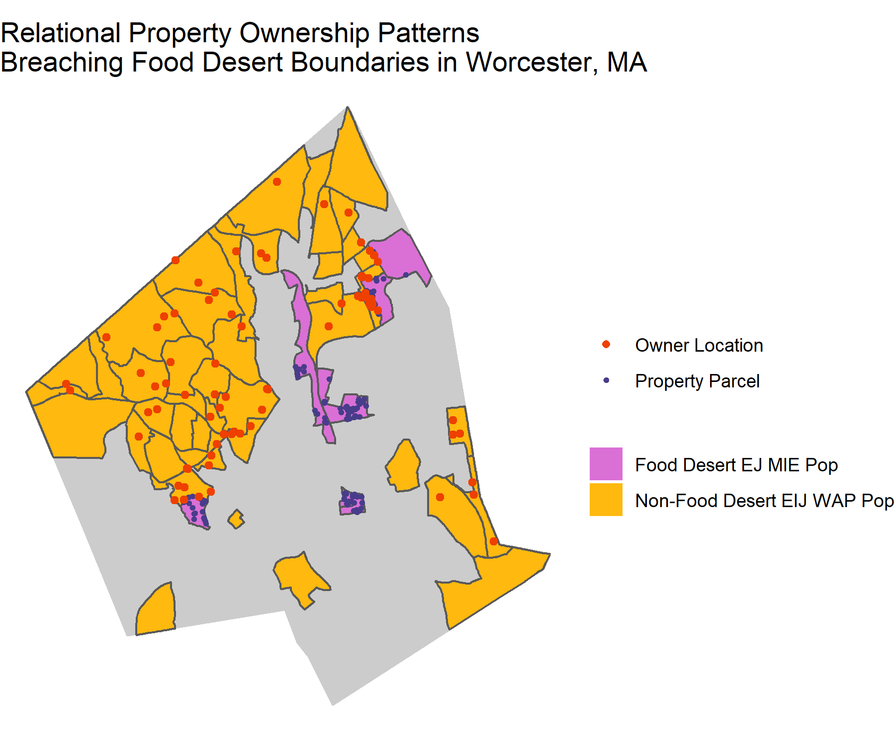

```{r setup, include=FALSE}
knitr::opts_chunk$set(echo = TRUE)
#library(igraph)
library(dplyr)
library(sf)
library(tidyverse)
library(ggmap) 
library(mapview) 
library(ggplot2)
```


## Objective

Examine the ownership relations of property parcels found within food deserts to see if and how property ownership is related to urban wealth and segregation patterns and thus has some role in contibuting to the respective food systems of these different parts of cities. 


## Mapping Process

### Read in data
```{r}
# read in EJ Populations
maejpop <- read_sf("C:/Users/Brenna Robeson/OneDrive/Masters_Research_Project/Empirics/GIS_Analysis/extdata/EJ_POLY.shp") 

# project maejpop to EPSG:32618, WSG84 UTM Zone 18N
maejpop <- st_transform(x = maejpop, crs = st_crs("+proj=utm +zone=18 +ellps=WGS84 +datum=WGS84 +units=m +no_defs"))

# filter out worcester
ejpop <- maejpop %>% st_as_sf() %>% filter(TOWN == "WORCESTER")

# read in EIJ Populations
eijpop <- read_sf("C:/Users/Brenna Robeson/OneDrive/Masters_Research_Project/Empirics/GIS_Analysis/extdata/eijpop.shp")

# project EIJ populations
eijpop <- st_transform(x = eijpop, crs = st_crs("+proj=utm +zone=18 +ellps=WGS84 +datum=WGS84 +units=m +no_defs"))

# fix EIJ pop column names 
# HOW TO FIX THIS UPSTREAM? (like in eijpop.Rmd?)
eijpop <- eijpop %>% rename(AREA_SQFT = AREA_SQ, MINORITY = MINORIT, EJ_CRITERI = EJ_CRIT, AFFLUENT = AFFLUEN, ENGLISHPROF = ENGLISHP)

# read in Worcester Census Tracts
ct <- read_sf("C:/Users/Brenna Robeson/OneDrive/Masters_Research_Project/Empirics/GIS_Analysis/extdata/Census_Tracts_2010.shp") 

# project wct to EPSG:32618, WSG84 UTM Zone 18N
ct <- st_transform(x = ct, crs = st_crs("+proj=utm +zone=18 +ellps=WGS84 +datum=WGS84 +units=m +no_defs"))

# read in food desert csv
fd <- read_sf("C:/Users/Brenna Robeson/OneDrive/Masters_Research_Project/Empirics/GIS_Analysis/extdata/DesAtlas_2015_WorcSel.csv")

# join fd .csv to census tract geometries
fdct <- left_join(ct %>% as.data.frame, fd, by = c("GEOID10" = "CensusTract")) %>% 
  as_tibble %>% st_as_sf()
```

### Prepare other pieces of analysis

#### Select census block groups to use for analysis
```{r}
# select EJ Populations (High Minority, Low Income, High English Proficiency) which fall in food deserts
fdejpop <- st_intersection(ejpop %>% filter(EJ_CRITERI == "MIE"), fdct %>%
                             filter(LILATracts_1And10 == "1" | LILATracts_halfAnd10 == "1")) %>%
  st_buffer(., dist = 0, endCapStyle = "ROUND", joinStyle = "ROUND") %>%
  mutate(INT_AREA = st_area(.) %>% measurements::conv_unit(., "m2", "ft2") %>% as.numeric) %>%
  st_as_sf() %>%
  filter(near(AREA_SQFT, INT_AREA, tol = 100000))

# # write fdej selection to shapefile
# st_write(fdejpop, "C:/Users/Brenna Robeson/OneDrive/Masters_Research_Project/Empirics/GIS_Analysis/extdata/fdejpop.shp")
  
# select EIJ Populations (AWP) which fall outside of food deserts
fdeijpop <- st_intersection(eijpop %>% filter(EIJ_GRP == "WAP"), fdct %>% filter(LILATracts_1And10 == "0" | LILATracts_halfAnd10 == "0")) %>%
  st_buffer(., dist = 0, endCapStyle = "ROUND", joinStyle = "ROUND") %>% 
  mutate(INT_AREA = st_area(.) %>% measurements::conv_unit(., "m2", "ft2") %>% as.numeric) %>% 
  st_as_sf() %>% 
  filter(near(AREA_SQFT, INT_AREA, tol = 100000))

# # write fdeij to shapefile
# st_write(fdeijpop, "C:/Users/Brenna Robeson/OneDrive/Masters_Research_Project/Empirics/GIS_Analysis/extdata/fdeijpop.shp")
```


#### Prepare Parcels Data
```{r}
# read in property parcels (from Worcester 2019 geodatabase)
parcels <- read_sf("C:/Users/Brenna Robeson/OneDrive/Masters_Research_Project/Empirics/GIS_Analysis/extdata/Basemap_Parcels_Polygons_19.shp") 
head(parcels)

# project parcels to EPSG:32618, WSG84 UTM Zone 18N
parcels <- st_transform(x = parcels, crs = st_crs("+proj=utm +zone=18 +ellps=WGS84 +datum=WGS84 +units=m +no_defs")) %>% st_as_sf()

# clip parcels data to only include area of food desert ejpops
parcelsinterfd <- st_intersection(x = fdejpop %>% select(AREA_SQFT, POP100_RE, MED_HH_INC, PCT_MIN, ENGLISH, INCOME, MINORITY, EJ_CRITERI, LILATracts_1And10, LILATracts_halfAnd10, LILATracts_1And20, LILATracts_Vehicle), y = parcels)

# read in property parcel ownership database (from ESRI geodatabase) as tibble
parcelsdb <- st_read(dsn = "C:/Users/Brenna Robeson/OneDrive/Masters_Research_Project/Empirics/GIS_Analysis/extdata/Worcester2019.gdb", layer = "BASEMAP_PARCELS_DATABASE", as_tibble = TRUE)
head(parcelsdb)

# join parcels database to fdejpop parcels shapefile (with respective fields "GIS_MBL" and "MAP_PAR_ID")
fdparcels <- left_join(parcelsinterfd %>% as.data.frame, parcelsdb %>% #select(CLASS, OWNER, RODYEAR, MAIL_STRET, MAIL_CITY, MAIL_STATE, MAIL_ZIP5, VALUE, ZONE, ZONE_NAME, BLDDESC, HOUSE_NO, STREET_PRE, STREET, LND_VALU, BLD_VALU, MAIL_STR2, GIS_MBL) %>% 
                         as.data.frame, by = c("MAP_PAR_ID" = "GIS_MBL")) %>% 
  as_tibble %>% st_as_sf() # do I need these??

# convert parcel geometries to points

# filter out residential properties only based on ZONE_NAME
res <- c("RESIDENTIAL", "RESIDENT")
fdparcels <- fdparcels %>% 
  filter(., str_detect(ZONE_NAME, paste(res, collapse="|")))
```


#### Geocode owner addresses for each parcel
```{r}
### REGISTER GOOGLE API KEY #####################
# register_google(key = "---", write = TRUE)
################################################

# # create more comprehensive address column to address "c/o"s in MAIL_STRET
# fdparcels <- fdparcels %>% mutate(MAIL_STR_CMB = MAIL_STR) %>% # how to identify c/os??? grepl/grep selection isn't working

# assess how many might be po box numbers...
# what does ggmap do with invalid/unlocated addresses?

# # concatenate different address pieces into a full address for geocoding
# fdparcels_add <- unite(fdparcels %>% as.data.frame(), ADDRESS_FULL, MAIL_STRET, MAIL_CITY, MAIL_STATE, MAIL_ZIP5, sep = ", ", remove = FALSE) %>% as_tibble()
# 
# # create seperate object to geocode owner addresses
# ownership <- fdparcels_add %>% select(MAP_PAR_ID, ADDRESS_FULL)
# 
# # use address column to geocode ownership locations
# ownership_gc <- ownership %>% as.data.frame() %>% 
#   mutate_geocode(., ADDRESS_FULL) %>% 
#   as_tibble()
# head(ownership_gc)

# # save results of geocoding to .csv 
# st_write(ownership_gc, "C:/Users/Brenna Robeson/OneDrive/Masters_Research_Project/Empirics/GIS_Analysis/extdata/ownership_gccoord.csv")

# read in csv with geocoded ownership addresses
ownership_gc <- read_sf("C:/Users/Brenna Robeson/OneDrive/Masters_Research_Project/Empirics/GIS_Analysis/extdata/fdej_ownership_gc.csv")

# clean geocoded ownership coordinate locations
ownership_gc <- ownership_gc %>% 
  rename(lon = lat, lat = lon)

# convert csv with ownership locations to sf object
ownership_gc <- ownership_gc %>% filter(!lon =="") %>% 
  st_as_sf(., coords = c("lat", "lon"), crs = 4326) %>% 
  st_transform(x = ., crs = st_crs("+proj=utm +zone=18 +ellps=WGS84 +datum=WGS84 +units=m +no_defs"))
 
# explore location of ownership points relative to fdej and fdeij
par(mar = c(0, 0, 0, 0))
plot(st_geometry(fdeijpop), col = "grey")
plot(st_geometry(fdejpop), col = "orange", add = TRUE)
plot(st_geometry(ownership_gc), col = "blue", pch = 1, add = TRUE)
#mapview(ownership_gc)

# # export ownership_gc as .shp
# st_write(ownership_gc, "C:/Users/Brenna Robeson/OneDrive/Masters_Research_Project/Empirics/GIS_Analysis/extdata/fdej_parcel_ownership.shp")
```

#### Exploratory Pre-Analysis Questions
```{r}
# Which owners are located within the food desert MEI areas?
own_fdej <- st_intersection(x = fdejpop %>% select(GEOID10, geometry), y = ownership_gc)
#mapview(own_fdej)

# Which owners are located within the non-food desert WAP areas?
own_fdeij <- st_intersection(x = fdeijpop %>% select(GEOID10, geometry), y = ownership_gc)
#mapview(own_fdeij)

# experimenting
# par(mar = c(0, 0, 0, 0))
# plot(st_geometry(fdejpop), col = "grey")
# plot(st_geometry(own_fdeij), col = "blue", pch = 20, add = TRUE)
```


### Plotting
```{r, warning = FALSE, message = FALSE, error = TRUE, fig.width=7, fig.height=5, fig.align='center', eval=FALSE}
# load in towns data to extract worcester boundary
worcester <- read_sf("C:/Users/Brenna Robeson/Documents/MassINC_Data/town_geo/gcboundaries.shp") %>% 
  st_transform(., crs = st_crs("+proj=utm +zone=18 +ellps=WGS84 +datum=WGS84 +units=m +no_defs")) %>% filter(TOWN == 'WORCESTER')

# convert fdparcels into centroids
fdparcels_wown <- inner_join(x = fdparcels %>% as.data.frame, y = own_fdeij %>% as.data.frame, by = "MAP_PAR_ID") %>% 
  st_as_sf %>% 
  st_centroid()
 
# plot parcels 
ownership_eij2ej <- ggplot() +
  geom_sf(data = worcester, fill = "gray80", col = "gray80", show.legend = FALSE) +
  geom_sf(data = fdeijpop, aes(fill = "Non-Food Desert EIJ WAP Pop")) +
  geom_sf(data = fdejpop, aes(fill = "Food Desert EJ MIE Pop")) +
  geom_sf(data = fdparcels_wown, aes(colour = "Property Parcel"), pch = 16, show.legend = "point") +
  geom_sf(data = own_fdeij, aes(colour = "Owner Location"), show.legend = "point") +
  scale_fill_manual(name = "", values = c("Non-Food Desert EIJ WAP Pop" = "darkgoldenrod1", "Food Desert EJ MIE Pop" = "orchid"), 
                    guide = guide_legend(override.aes = list(linetype = c("blank", "blank"), shape = c(NA, NA)))) +
  scale_colour_manual(name = "", values = c("Property Parcel" = "darkslateblue", "Owner Location" = "orangered2"),
                      guide = guide_legend(override.aes = list(linetype = c("blank", "blank"), shape = c(16, 16)))) +
  theme(legend.key = element_rect(fill = "white")) +
  ggtitle("Relational Property Ownership Patterns \nBreaching Food Desert Boundaries in Worcester, MA") +
  theme_void() + # Empty theme without axis lines and texts
  theme(
    panel.background = element_rect(fill = "transparent", colour = NA),
    plot.background = element_rect(fill = "transparent", colour = NA),
    legend.background = element_rect(fill = "transparent", colour = NA),
    legend.box.background = element_rect(fill = "transparent", colour = NA)
  ) +
  coord_sf(datum = NA)
ownership_eij2ej

# export map to .png
ggplot2::ggsave(ownership_eij2ej, filename = "C:/Users/Brenna Robeson/OneDrive/GEOG346/worcfoodaccess/figures/ownership_plot.png", 
       width = 6, height = 5, units = "in", dpi = 300)
```

```{r, echo = FALSE, out.width="100%"}

```


## Limitations

Future versions of this map should work in ways to capture the vastness of the network of food desert property owners, as well as stylistically include lines between specific properties and the "location" of their owners.
