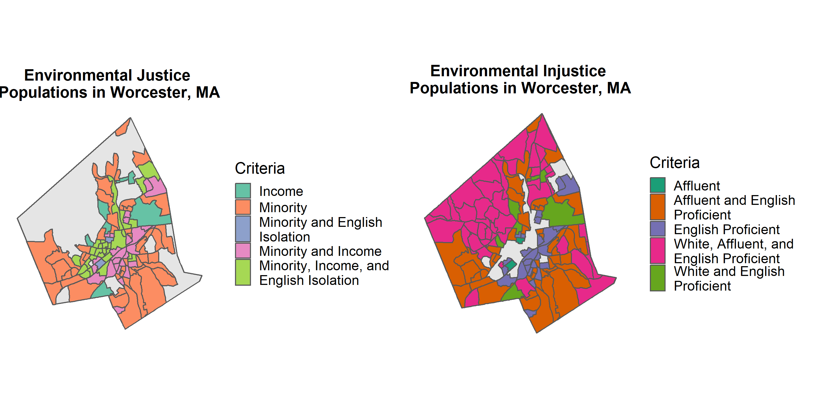

```{r setup, include=FALSE}
knitr::opts_chunk$set(echo = TRUE)
library(knitr)
```

## Introduction

Food deserts as a concept and a cartographic phenomenon provide an assessment tool to understand a major aspect of food accessibility for many urban residents. Maps focusing on single cities, as in the case of the 2015 Worcester Community Health Assessment (shown below), or on the entire country, as the USDA has modeled, use simplified criteria like income level and supermarket proximity to geographically define neighborhoods or cities as deprived or dry of any food resources (Central MA Regional Public Health Alliance 2015; “USDA ERS - Go to the Atlas” n.d.). 

```{r, out.width = "80%", echo=FALSE, fig.align='center'}

```

While these maps elaborate on a critical component of food accessibility in assessing grocery store proximity, food justice activists and “food desert” residents assert that there is much more to the story of food access than these depictions suggest (Brones 2018). The historic and present-day injustices that shape food access does not seem to be conveyed by these static and sterile maps. In order to address the roots of food inaccess therefore, a critically-informed approach is needed that understands and produces maps as they language of power they are (Schuurman 2000).

This project, as a component of a larger research project using a mixed-methods approach to better map food access and food injustices, provides a starting place for alternative gis practices which can reframe conversations about what drives food inaccess. Because the narratives maps propose are equally shaped by what is said and what is left unsaid by cartographers, the maps produced in this project will explore how to engage with the silences found in food desert mapping to more direct illuminate the power dynamics governing food access (Harley 1992; Elwood, Lawson, and Sheppard 2017). 

Specifically, I will use demographic census data, as well as data detailing features of the built urban environment, to understand relationships tying different people together in different, uneven(??) ways through spatial configurations that enable or restrict food access. Through developing two outputs:

1.  Map of Worcester’s Environmental Injustice Populations, based on MassGIS’s Environmental Justice Populations (https://docs.digital.mass.gov/dataset/massgis-data-2010-us-census-environmental-justice-populations?_ga=2.99772631.856141472.1548130339-583552954.1544722457)
2.  Exploration of automobility in urban landscapes and if and how white and affluent populations insulate themselves using parking infrastructure and auto-friendly residential zoning

I hope the narratives these two maps provide can stimulate thinking about how maps that inform political decision making can frame problems and influence policy agendas to challenge power dynamics so often upheld through these tools.


## Methods

My analysis process involved using vector data, mainly census data at the block group level, as well as data from the city of Worcester detailing features of the built environment, to create multiple choropleth maps. To preform both phases of my analysis, I relied most heavily on `tidyverse` packages, such as `dplyr` and `tidyr` to clean and organize my data, and on `ggplot2` to create my visualizations.

The detailed process I took to create both outputs can be found in the two other vignettes within this package, * Perspective 1: Environmental Injustice Populations in Worcester, MA* and * Perspective 2: Automobility and Food Access*.


## Results

Both my Environmental Injustice Populations map and automobility spatial analysis confirm urban spatial patterns that have long been experienced, perpetuated, and researched, which establish a context in which food injustice can be perpetuated. 

```{r, out.width = "80%", echo=FALSE, fig.align='center'}

```

Specifically, in the case of my Environmental Injustice (EIJ) Populations map above, while this map is more conceptual than statistical in purpose, it suggests strong concentrations of block groups where households identify as both Affluent and English Proficient on the southwest and southern edges of the city, as well as a clustering of block groups representing White, Affluent, and English Proficient families across the entire west side of the city. In this map’s “holes” or silences, it can also be seen that the entire urban core is missing, meaning that the inverse categories of these three compounding oppressive categories from the Injustice map, can be seen coalescing together to form another homogenized section of the city.

```{r, out.width = "80%", echo=FALSE, fig.align='center'}
knitr::include_graphics("../figures/automob_plot.png")
```

The automobility ratio analysis, which compares the total area of driveway infrastructure in a census block group to the total area of the building footprints, seems to confirm this clustering to an extent. Many polygons which were identified as White, Affluent, and English Proficient on the EIJ map had high ratios which indicates more driveway space is designated in these neighborhoods than in other parts of the city, facilitating an automobile existence. It is equally clear that many polygons identified as Minority, low income, and English isolated showed some of the lowest ratios of driveway space to built environment.

## Discussion

These two sets of maps show that spatial inequities are deeply built into the fabric of Worcester, and are even built into the way that maps are made. Looking beyond the normal confines of policy conversations around food access reveals that problems of food inaccess stretch much deeper than the absence of grocery stores. They involve structural processes of inequality which are manifest in concrete ways, such as the abundance of driveways in certain areas of the city. Instead of looking for deficits in marginalized neighborhoods, looking at processes by which these injustices occur can make deeper and more profound interventions possible to ensure greater food access is simultaneously advancing food justice.

In future iterations of this project, I hope to incorporate more advanced data and analytical packages such as `igraph` for network analysis and `tidycensus` to incorporate more specialized census data. Specifically, I hope a third output can look at the ownership of properties in areas of the city deemed food deserts to understand how localized control of these neighborhoods is, or if there is an infringement on community autonomy which affects localized food systems.


## References

Brones, Anna. 2018. “Karen Washington: It’s Not a Food Desert, It’s Food Apartheid.” Guernica. May 7, 2018. https://www.guernicamag.com/karen-washington-its-not-a-food-desert-its-food-apartheid/.

Central MA Regional Public Health Alliance. 2015. “Greater Worcester Community Health Assessment 2015 CHA.” http://healthycentralma.com/wp-content/uploads/2015/11/2015-Greater-Worcester-Community-Health-Assessment-11-19-15-for-web.pdf.

Elwood, Sarah, Victoria Lawson, and Eric Sheppard. 2017. “Geographical Relational Poverty Studies.” Progress in Human Geography 41 (6): 745–65. https://doi.org/10.1177/0309132516659706.

Harley, J. B. 1992. “Deconstructing the Map.” Passages. http://hdl.handle.net/2027/spo.4761530.0003.008.

Schuurman, Nadine. 2000. “Trouble in the Heartland: GIS and Its Critics in the 1990s.” Progress in Human Geography 24 (4): 569–90. https://doi.org/10.1191/030913200100189111.

“USDA ERS - Go to the Atlas.” n.d. Accessed April 24, 2018. https://www.ers.usda.gov/data-products/food-access-research-atlas/go-to-the-atlas/.


